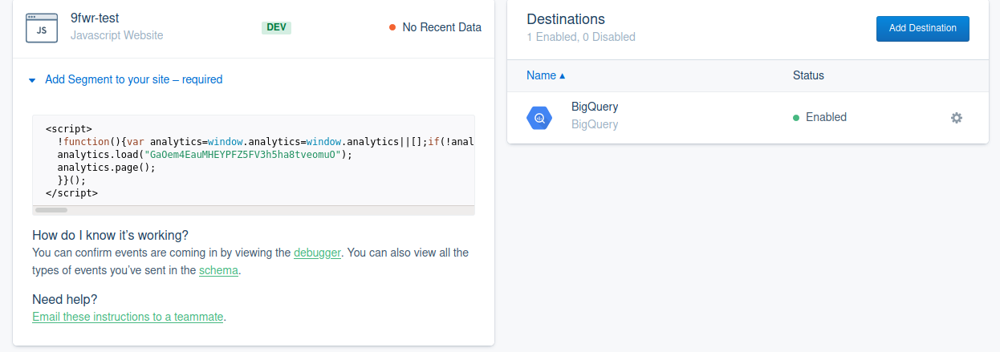
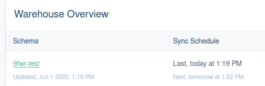

# 9fwr test

Create a document (e.g. on google drive) which describes the steps you took to create this
data stack. Think of a document that a coworker can use to quickly reproduce your setup. Be
concise but show important steps, use screenshots if feasible, show code, JS, SQL, etc
(only important parts, if any) note down decisions that you made.

## Recap

### enable tracking

- we will use [segment.io](segment.io) to track interactions with the website - create an account if you do not have one yet
- implement the tracking snippet in the `head` of your html page, you can follow [the documentation ](https://segment.com/docs/getting-started/02-simple-install/) for the Javascript quickstart
- after this you should have, added a source -> https://app.segment.com/<your-account>/sources/setup/javascript (change to your account) and added the tracking javascript snippet to your page
- by default a pageview event is integrated when you implement the snippet, so that we don't have to worry about implementing
- I used jQuery 3.5.1 to additionally trigger the CTA-event on the button-click and followed the segment [documentation](https://segment.com/docs/connections/spec/track/) (_jQuery was selected due to its broad potential across browsers, ease of use and potential to be used when no access to the source code is possible_)
- for more details see [the actual implementation](https://github.com/maikroservice/maikroservice.github.io/blob/master/9fwr/index.html#L89)

### setup bigquery

- you can again follow the excellent segment [documentation](https://segment.com/docs/connections/warehouses/catalog/bigquery/#create-a-project-and-enable-bigquery)
- you will need to create a project and enable BigQuery
- then [create a service account for segment](https://segment.com/docs/connections/warehouses/catalog/bigquery/#create-a-service-account-for-segment) to be able to push the data to your BigQuery warehouse - ** remember to download the json key and store the content somewhere safe (e.g. [bitwarden](https://bitwarden.com/)) **
- subsequently [create a warehouse in segment](https://segment.com/docs/connections/warehouses/catalog/bigquery/#create-the-warehouse-in-segment)
- and last but not least connect the source and destination - if all went well your overview should look something like this:
   <br />
- you can then use the debugger to check if your events are triggered as expected
  

**note: Data might only be pushed to BigQuery once a day if you have a free account - remember that when looking for missing data**

### setup dashboard & queries in [redash.io](https://redash.io/)

- create a redash account and a corresponding organization or join an already existing organization
- note: redash associates SQL queries with visualizations, so you first might have to wait 24h to get your data synced into BigQuery for you to be able to get it into redash and create graphs - you can see when the next sync will happen by selecting your warehouse from the 'destinations' it will look something like this:

  

- we want to create three different graphs to visualize

1. pageviews
2. unique visitors
3. conversion rate (clicks on the button)

you can use the following query for graph 1 and 2

```sql
SELECT url,
       count(DISTINCT context_ip) AS visitors,
       count(url) AS pageviews,
       EXTRACT(DATE
               FROM TIMESTAMP) AS ts
FROM `<your-BigQuery-Project>.pages_view`
WHERE url LIKE '%<url-you-are-looking-to-track>%'
GROUP BY url,
         ts;
```

for the third graph we need to calculate the conversion rate in percent (`clicks * 100 / unique visitors`)
which can be done by using this query:

```sql
SELECT EXTRACT(DATE
               FROM pages.TIMESTAMP) AS ts,
            (COUNT (DISTINCT tracks.context_ip) * 100 /
            COUNT (DISTINCT pages.context_ip)) as conversion_rate
FROM `<your-BigQuery-Project>.pages` pages
LEFT JOIN `<your-BigQuery-Project>.tracks` tracks ON tracks.context_ip = pages.context_ip
GROUP BY ts
ORDER BY ts;
```

the setup of the graphs/queries is the same for all three graphs:

- create new query, copy/paste the sql code, give the query a distinct name, save and execute the query
- create a `New Visualization` and choose line-graph or bar-graph as the chart type (this depends on your use-case, I find it easier to follow trends in line-graphs but this is a personal preference)
- the graph is suppossed to be shown over time, so use your date column `ts` as the X Column, and the metric (`pageviews`, `visitors` or `conversion_rate` depending on the visualization) as the Y Column
- if you use more than one url, you might want to group by `url`
- give your X-axis and Y-axis a suitable name and subsequently label your series
- you can also change the color for corporate identity look and feel according to your specifications
- I would encourage you to also enable `data labels` for easier readibility
- now you can create a dashboard and add the visualization to the dashboard - see

  

- remember to publish the dashboard in the end by clicking the publish button ;)

## Adhoc questions

### SQL

Suppose you have a table that contains records about customers
(`NAME`,`CITY`,`PROFESSION`,`AGE`). When customer data changes an ETL process uploads
new versions of the record to the table. This will however not change the existing record of
the customer but rather add a new record with the new data. The ETL process fills a
columns `LOADDATE` with the current timestamp of when the upload happened. Sketch a
query that returns a list of cities and the number of customers currently living there.

**Answer** - this can be done for example with an `inner join` and the `max` function - _I assume that the name is unique, which is most likely is not_
_one should always use a unique identifier/primary key in the table design/data modeling which is not present in the example table unfortunately_

```sql
SELECT t.city, count(t.name) as inhabitants
FROM ninefwr_sql_test t
INNER JOIN (
	SELECT name, max(load_date) as max_date
	FROM ninefwr_sql_test
	GROUP BY name
	) AS tm ON (t.name = tm.name) AND (t.load_date = tm.max_date)
GROUP BY city;
```

### Tracking​

Using Google Tag Manager, sketch a way how to trigger a marketing conversion tag (e.g. Facebook Pixel) only the first time a user hits the page “/convert.html”.

This is impossible if you ask me, because there are multiple avenues as to why it might not be the 'first' time for a user to hit the page (deleted cookies, different device, different user same device/browser).
I will however sketch an attempt very, very briefly:

One idea could be to save a binary-flag in a persistent cookie and read this cookie when the user visits the page - the event would then only be fired if the flag is not present.

Combining information from device/user/browser/behaviour etc. into a cross-device-UUID is used for example in Adobe to track users across devices,
however even using this method there is a multitude of problems that could miss the 'first' time a user did something and do it multiple times, which is why I think it is not possible per definition to only do this once.
There are abstractions towards being better at it than firing this every time someone enters a website but _currently there is no way - to my knowledge - to achieve this_.

### ETL/python

Complete the following python script which extracts public COVID data and loads it into BigQuery.
The data source provides the data in pivoted form, row are countries and columns are dates.
We need the unpivoted form where rows are facts with the dimensions country and date.
The script is missing the unpivoting operation.

**Answer**

```python
import requests
# changed name to abide pandas convention
import pandas as pd
import time
import io
from datetime import datetime,date,timedelta
from google.cloud import bigquery


def main():
    csvResponse = requests.get('https://raw.githubusercontent.com/CSSEGISandData/COVID-19/master/csse_covid_19_data/csse_covid_19_time_series/time_series_covid19_confirmed_global.csv').text
    df = pd.read_csv(io.StringIO(csvResponse))
    df.drop(["Province/State",'Lat','Long'],axis=1,inplace=True)
    df = df.rename(columns={"Country/Region": "country"})
    df_unpivoted = df.melt(id_vars=['country'], var_name='date', value_name='confirmed_cases')

    # ignore BigQuery Loading for this test
    # client = bigquery.Client()
    # table_id='f-26914.test_covid.confirmed'
    # job_config = bigquery.LoadJobConfig(
    # write_disposition="WRITE_TRUNCATE"
    # )
    # job = client.load_table_from_dataframe(
    # df,
    # table_id,
    # job_config=job_config,
    # location="europe-west3",
    # )
    # job.result()

if __name__ == '__main__':
    main()
```
